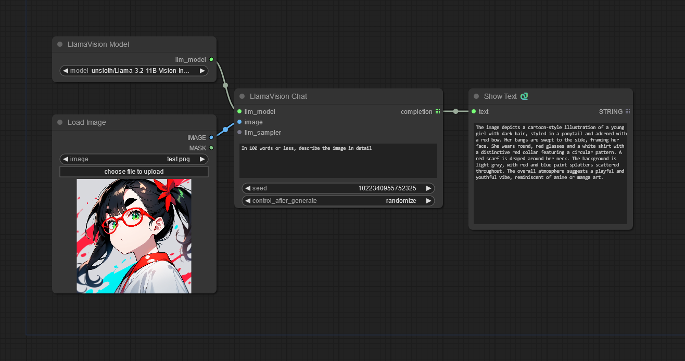

# (Yet Another) Llama Vision Node for ComfyUI

A set of nodes for basic Llama 3.2 Vision support in ComfyUI. Give it an image and query and it will output a text response.

(The "Show Text" node is from https://github.com/pythongosssss/ComfyUI-Custom-Scripts/)

You can adjust the LLM sampler settings with the included "LLM Sampler Settings" node. However, this is completely optional and without it, the model's default settings will be used, which is usually: temperature 0.6, top-p 0.9. (See `generation_config.json` in the model's repo.)

## Installation

Clone into your `custom_nodes` directory and install the dependencies:

    path/to/ComfyUI/pip install -r YALLM-LlamaVision/requirements.txt

This will upgrade your Huggingface `transformers` module to 4.45 or later, which is needed for Llama 3.2 Vision. It will also install the HF `bitsandbytes` package for running quantized (e.g. nf4) models.

## Models

Out of the box, it uses the nf4 quantized model at https://huggingface.co/unsloth/Llama-3.2-11B-Vision-Instruct-bnb-4bit (for best results, you should probably have at least 10GB of VRAM).

Other options are available, including the original unquantized (BF16) version.

See `models.yaml.default` for details. By default, models are downloaded into the `models/LLM` directory within ComfyUI. I know some people (including myself) like having them download into their Huggingface cache (`~/.cache/huggingface`) instead, where they can be easily shared with other projects/notebooks. This can be enabled on a per-model basis.

You can customize the model list by:

    cp models.yaml.default models.yaml

and then editing `models.yaml` to taste.

Also, no, I haven't tested it with 90B!

## License

Licensed under [BSD-2-Clause-Patent](https://opensource.org/license/bsdpluspatent).
